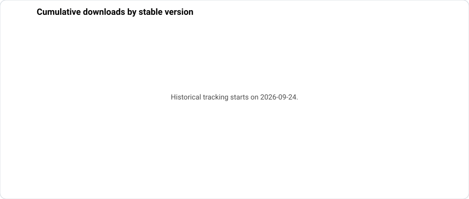

# TSUN Local — Download statistics

This page tracks downloads of the **TSUN Local release package**.

> [!IMPORTANT]
> These numbers are **download counts, not user counts**.
>
> A download can be an initial installation, an update, or a reinstall. The same installation can therefore contribute to several version counters over time.

## Current snapshot

The summary is refreshed automatically from GitHub Releases.

## Stable releases — live counters

| Version | Release package downloads |
|:---:|:---:|
| [1.6.2](https://github.com/jptstar/tsun-local/releases/tag/v1.6.2) |  |
| [1.6.1](https://github.com/jptstar/tsun-local/releases/tag/v1.6.1) |  |
| [1.6.0](https://github.com/jptstar/tsun-local/releases/tag/v1.6.0) |  |
| [1.5.4](https://github.com/jptstar/tsun-local/releases/tag/v1.5.4) |  |
| [1.5.3](https://github.com/jptstar/tsun-local/releases/tag/v1.5.3) |  |
| [1.5.2](https://github.com/jptstar/tsun-local/releases/tag/v1.5.2) |  |
| [1.5.1](https://github.com/jptstar/tsun-local/releases/tag/v1.5.1) |  |
| [1.4.1](https://github.com/jptstar/tsun-local/releases/tag/v1.4.1) |  |

## Download history

Historical tracking starts on **2026-09-24**. GitHub exposes the current cumulative download count for a release asset, but not its past day-by-day history, so daily history can only be recorded from this date onward.

### New downloads per day

This chart shows the difference between two consecutive daily snapshots, summed across the stable releases being tracked.

### Cumulative downloads by version

This makes it easier to see whether a new stable release continues to gain downloads and how its adoption evolves compared with previous stable versions.

The raw snapshots are stored in [`download-stats.csv`](download-stats.csv).

## How it works

A GitHub Actions workflow records the download count of the `tsun-local.zip` release asset once per day and whenever a new release is published. It keeps the historical snapshots in the repository and regenerates the summary and charts automatically.

The tracked statistics are useful for comparing release activity and update adoption, but they must **not** be interpreted as unique users or active installations.

## Privacy

No telemetry is added to TSUN Local for these statistics.

The counters come exclusively from **GitHub Release asset download counts**. TSUN Local does not send an installation identifier, inverter information, solar data, network information or Home Assistant data for this page.
